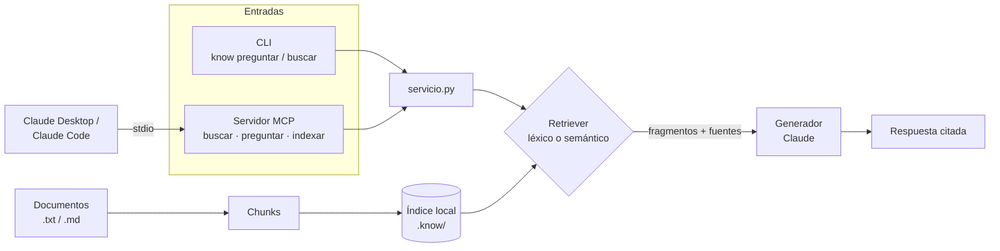

# know

CLI en Python que indexa una carpeta de documentos y responde preguntas en
**lenguaje natural** sobre ellos, **citando las fuentes**, con **Claude**. También
funciona como **servidor MCP**, para que Claude Desktop o Claude Code consulten tus
documentos como una herramienta más.

> **Demo en video:** (pendiente)

## El problema

Casi toda empresa acumula años de manuales, procedimientos y especificaciones:
carpetas compartidas, PDFs, wikis a medio actualizar. La información existe, pero
nadie la encuentra. Se termina buscando a mano o preguntándole a la persona con más
años en la empresa, lo cual no escala y se pierde cuando esa persona se va.

`know` hace esa documentación **consultable al instante**: indexas la carpeta una
vez y después haces preguntas como *"¿cada cuánto se cambia el rollo de etiqueta?"*.
Claude responde **solo con base en tus documentos**, dice de qué archivo salió cada
dato y, si la respuesta no está, contesta *"No encontré esa información"* en vez de
inventarla. Es un RAG (Retrieval-Augmented Generation) de terminal.

> **Stack:** Python 3.11+, `typer` (CLI), SDK oficial `anthropic` (generación con
> Claude), SDK oficial `mcp` (servidor MCP), `google-genai` (embeddings del modo
> semántico), `numpy` (similitud de coseno) y `python-dotenv` (leer las API keys).
> Entorno y dependencias con `uv`.

## Cómo funciona



1. **Indexar:** lee los documentos, los parte en *chunks* (fragmentos con un pequeño
   solape para no cortar ideas) y guarda un índice local.
2. **Recuperar:** ante una pregunta, busca los chunks más relevantes.
3. **Generar:** manda a Claude esos chunks como contexto en el *system prompt*, junto
   con las reglas: responder solo con base en ellos, citar el archivo y decir
   *"No encontré esa información"* si no está.

El CLI y el servidor MCP son solo **puertas de entrada**: ambos llaman a las mismas
funciones de `servicio.py`, así que la lógica no se duplica.

La recuperación y la generación están detrás de un `Protocol` (interfaz) cada una,
de modo que `rag.py` no depende de ningún proveedor.

**Recuperación (`--modo`):**

- **`lexical`** (por defecto): coincidencia por palabras (TF-IDF), con solo la
  librería estándar. Sin costo y sin servicios externos.
- **`semantico`**: usa *embeddings* para buscar por **significado**, no solo por
  palabras (encuentra "banda" cuando preguntas por "cinta").

### ¿Por qué los embeddings no usan Claude?

Anthropic **no tiene un modelo de embeddings propio**. Para el modo semántico se
usa Gemini (`gemini-embedding-001`, con capa gratuita), y es lo **único** que
requiere `GEMINI_API_KEY`. Anthropic recomienda [Voyage AI](https://www.voyageai.com/)
como proveedor de embeddings; cambiarlo implica reemplazar solo `embeddings.py`,
gracias al contrato `Retriever`. El modo léxico más la generación funcionan solo con
`ANTHROPIC_API_KEY`.

## Requisitos

- Python 3.11 o superior.
- [uv](https://docs.astral.sh/uv/) para el entorno y las dependencias.
- Una API key de Anthropic en `ANTHROPIC_API_KEY`
  (se obtiene en <https://console.anthropic.com/>). Hace falta para **generar**
  respuestas (`preguntar`).
- *(Solo para el modo semántico)* una API key gratuita de Gemini en
  `GEMINI_API_KEY` (<https://aistudio.google.com/apikey>, sin tarjeta).

`indexar` y `buscar` en modo léxico funcionan **sin ninguna key**.

### Variables de entorno

Ponlas en tu terminal o en un archivo `.env` en la raíz (ya está en `.gitignore`):

| Variable                | Obligatoria        | Default               | Qué hace                                      |
| ----------------------- | ------------------ | --------------------- | --------------------------------------------- |
| `ANTHROPIC_API_KEY`     | Para `preguntar`   | —                     | API key de Anthropic (generación).            |
| `GEMINI_API_KEY`        | Solo modo semántico| —                     | API key de Gemini (embeddings).               |
| `KNOW_MODEL`            | No                 | `claude-sonnet-5-5`   | Modelo Claude que genera la respuesta.        |
| `KNOW_EMBEDDINGS_MODEL` | No                 | `gemini-embedding-001`| Modelo de embeddings (modo semántico).        |
| `KNOW_INDEX`            | No                 | `.know`               | Carpeta del índice del servidor MCP.          |

```bash
ANTHROPIC_API_KEY=sk-ant-...
```

> **Nunca** pongas una key en el código ni la subas al repositorio. Usa una variable
> de entorno o el archivo `.env` local.

## Instalación y uso

```bash
# Crea el entorno e instala dependencias desde pyproject.toml
uv sync

# 1) Indexar una carpeta de documentos (modo léxico, sin costo)
uv run know indexar ./tests/data/docs

# 2) Preguntar en lenguaje natural (genera con Claude; cita las fuentes)
uv run know preguntar "¿cada cuánto se cambia el rollo de etiqueta?"

# 3) (Depuración) ver qué fragmentos se recuperan, sin generar respuesta
uv run know buscar "etiqueta" --k 5

# Modo semántico (calcula embeddings; requiere GEMINI_API_KEY)
uv run know indexar ./tests/data/docs --modo semantico
uv run know preguntar "¿con qué frecuencia se reemplaza la bobina?" --modo semantico

# Elegir otro modelo de Claude
KNOW_MODEL=claude-opus-5-5 uv run know preguntar "¿qué pasa con una falla mecánica larga?"
```

## Subcomandos y flags

| Subcomando  | Qué hace                                                              |
| ----------- | --------------------------------------------------------------------- |
| `indexar`   | Construye y guarda el índice a partir de una carpeta.                 |
| `preguntar` | Recupera contexto y genera una respuesta citada con Claude.           |
| `buscar`    | Solo recuperación (muestra los chunks); útil para depurar.            |
| `mcp`       | Levanta el servidor MCP por stdio (también disponible como `know-mcp`).|

| Flag        | Por defecto | Qué hace                                      |
| ----------- | ----------- | --------------------------------------------- |
| `--modo`    | `lexical`   | `lexical` o `semantico`.                      |
| `--k`       | `5`         | Cuántos fragmentos recuperar como contexto.   |
| `--indice`  | `.know`     | Dónde se guarda/lee el índice.                |

## Usar con Claude (MCP)

[MCP](https://modelcontextprotocol.io/) (Model Context Protocol) es el estándar que
permite a Claude usar herramientas externas. `know mcp` levanta un servidor por
**stdio** que expone:

| Herramienta                      | Qué hace                                                            |
| -------------------------------- | ------------------------------------------------------------------- |
| `buscar(consulta, k, modo)`      | Devuelve los fragmentos más relevantes, con su archivo de origen.   |
| `preguntar(pregunta, k, modo)`   | Devuelve la respuesta de Claude citando las fuentes.                |
| `indexar(carpeta, modo)`         | Indexa una carpeta (reemplaza el índice de `KNOW_INDEX`).           |

Antes, indexa tus documentos en una ruta **absoluta** y úsala como `KNOW_INDEX`:

```bash
KNOW_INDEX=/Users/tu-usuario/know-indice uv run know indexar /Users/tu-usuario/manuales
```

> Si Claude Desktop o Claude Code ya hacen el razonamiento, con `buscar` basta: les
> devuelve los fragmentos y ellos redactan la respuesta, sin necesidad de
> `ANTHROPIC_API_KEY` en el servidor. `preguntar` sí la requiere porque llama a
> Claude por su cuenta.

### Claude Desktop

Abre *Settings → Developer → Edit Config* (el archivo es
`~/Library/Application Support/Claude/claude_desktop_config.json` en macOS) y agrega:

```json
{
  "mcpServers": {
    "know": {
      "command": "uv",
      "args": [
        "run",
        "--directory",
        "/Users/tu-usuario/Developer/know-cli",
        "know",
        "mcp"
      ],
      "env": {
        "KNOW_INDEX": "/Users/tu-usuario/know-indice",
        "ANTHROPIC_API_KEY": "sk-ant-..."
      }
    }
  }
}
```

Reinicia Claude Desktop por completo. Las rutas deben ser absolutas; si `uv` no se
encuentra, usa su ruta completa (`which uv`). Los logs del servidor están en
`~/Library/Logs/Claude/mcp-server-know.log`.

### Claude Code

```bash
claude mcp add know \
  --env KNOW_INDEX=/Users/tu-usuario/know-indice \
  --env ANTHROPIC_API_KEY=sk-ant-... \
  -- uv run --directory /Users/tu-usuario/Developer/know-cli know mcp
```

Comprueba que quedó registrado con `claude mcp list` (o `/mcp` dentro de Claude
Code).

### Probarlo con el Inspector de MCP (requiere Node.js)

```bash
KNOW_INDEX=./.know uv run mcp dev src/know/mcp_server.py
```

## Tests y evaluación

```bash
uv run pytest            # tests: chunking, coseno, rag, generación (cliente de
                         # Anthropic mockeado), herramientas MCP y CLI
uv run python evals.py   # mide el "hit rate" de la recuperación con golden examples
```

Los tests **no llaman a ninguna API** (el cliente de Anthropic se reemplaza por uno
falso), así que corren rápido y gratis. `evals.py` usa el modo léxico para correr
offline.

## Estructura

```
know/
├── pyproject.toml          # metadatos, dependencias y los comandos "know" y "know-mcp"
├── evals.py                # eval de recuperación (hit rate)
├── src/know/
│   ├── __main__.py         # punto de entrada (python -m know)
│   ├── cli.py              # comandos (typer): indexar, preguntar, buscar, mcp
│   ├── mcp_server.py       # servidor MCP (stdio): buscar, preguntar, indexar
│   ├── servicio.py         # lógica compartida por el CLI y el servidor MCP
│   ├── docs.py             # cargar documentos y partir en chunks
│   ├── index.py            # guardar/cargar el índice (chunks y vectores)
│   ├── retrieve.py         # Protocol Retriever + LexicalRetriever + SemanticRetriever
│   ├── embeddings.py       # embeddings con Gemini (solo modo semántico)
│   ├── llm.py              # Protocol Generador + ClaudeGenerador (SDK anthropic)
│   └── rag.py              # orquesta: recuperar → generar
└── tests/
    ├── data/docs/          # documentos de ejemplo para probar
    └── test_*.py           # pruebas con pytest
```

Las piezas centrales son los `Protocol`:

```python
from typing import Protocol
from know.docs import Chunk

class Retriever(Protocol):
    def indexar(self, chunks: list[Chunk]) -> None: ...
    def buscar(self, consulta: str, k: int) -> list[Chunk]: ...

class Generador(Protocol):
    def responder(
        self, pregunta: str, contexto: list[Chunk], modelo: str | None = None
    ) -> str: ...
```

Cambiar de búsqueda por palabras a semántica, o de proveedor de modelo, es cambiar la
**implementación**, no el resto del programa: `rag.py` no se entera. Ese es el punto.

## Alcance honesto

Es un proyecto de portafolio y aprendizaje, no un sistema de producción. Lo que
**sí** hace: indexar `.txt` y `.md`, recuperar por palabra (TF-IDF) o por embeddings,
generar respuestas citadas con Claude sin inventar datos, exponerlas como servidor
MCP y medir la recuperación con un eval.

Lo que **no** hace todavía:

- PDFs, Word u otros formatos.
- Índice en base vectorial (el índice es un JSON local, suficiente para pocos
  documentos).
- Re-ranking ni búsqueda híbrida.
- Autenticación ni control de acceso por documento en el servidor MCP: quien lo
  conecte puede consultar todo el índice.
- El eval es chico (3 ejemplos) y mide solo la recuperación, no la calidad de la
  respuesta generada.
- Los embeddings dependen de Gemini porque Anthropic no ofrece un modelo propio.

## Ideas para crecerlo

- **Persistir en Postgres + `pgvector`:** reemplazar el índice en archivo por una
  tabla con columna `vector`.
- **Embeddings con Voyage AI**, el proveedor que recomienda Anthropic, para dejar
  todo el stack en un ecosistema.
- **Soporte de PDF** para manuales reales (`pypdf`).
- **Búsqueda híbrida:** combinar léxico (exactitud en códigos y nombres) y semántico
  (sinónimos) para lo mejor de ambos.
- **Citas precisas** con la API de citas de Claude: que la respuesta señale el
  documento y el fragmento exacto.
- **Prompt caching** del contexto y streaming de la respuesta para bajar costo y
  latencia.
- **Evals de la generación** (fidelidad al contexto y "No encontré esa información"
  cuando corresponde), con un modelo como juez.
- **Transporte HTTP** del servidor MCP para compartirlo con un equipo, con
  autenticación.
